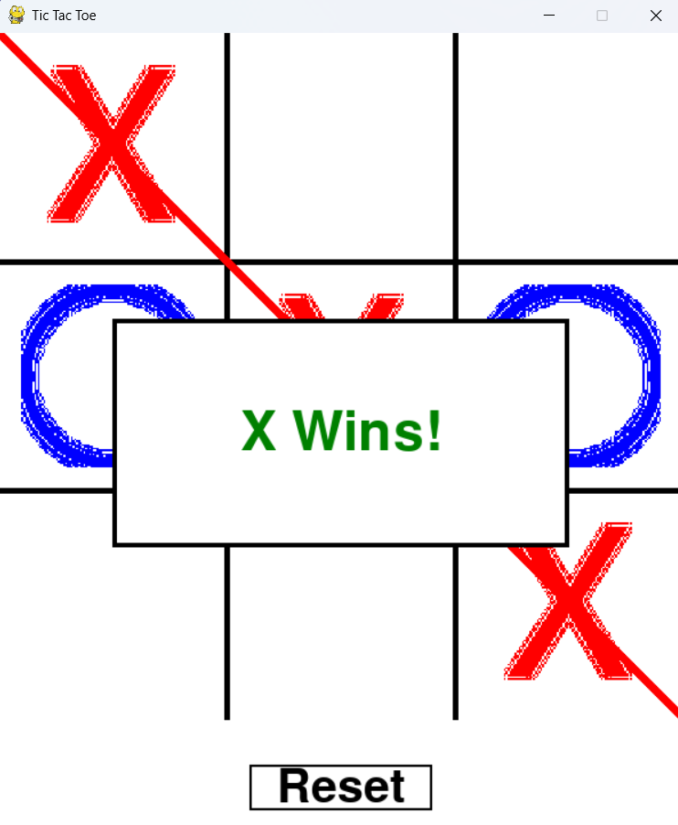

# 🎮 Tic Tac Toe — Pygame Edition

A simple, elegant Tic Tac Toe game built with Python and Pygame. It includes support for:

- Custom X and O images
- Winning line animation
- Winner display popup

## Preview

  

## Requirements

- Python 3.x
- [Pygame](https://www.pygame.org/) library

Install requirements:

```bash
pip install pygame
git clone [https://github.com/YOUR_USERNAME/tic-tac-toe-pygame.git](https://github.com/snehs19space/100_Projects/tree/main/Day1/Tic-Tac-Toe)
```

## License
This project is licensed under the MIT License - see the [LICENSE](https://github.com/snehs19space/100_Projects/blob/main/LICENSE) file for details.
